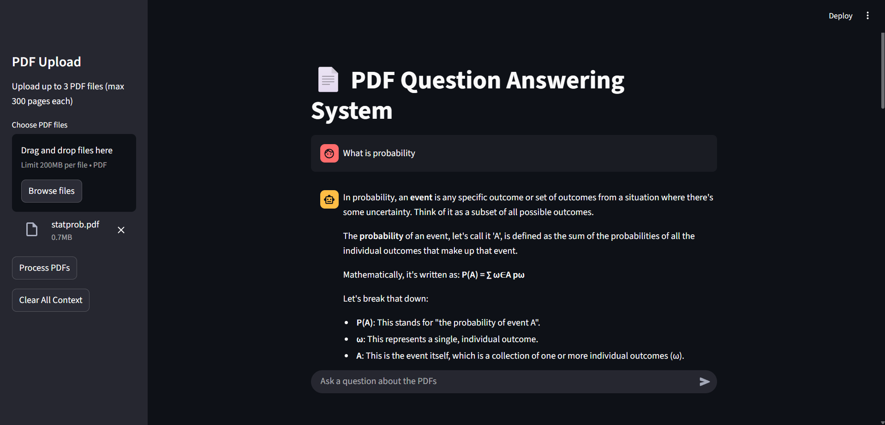

# NeuroQuery: Free AI Document Intelligence


A **completely free** document question answering system that extracts knowledge from your PDFs using AI - **no API keys required!**

## ✨ Features

| Feature | Description |
|---------|-------------|
| 🆓 **100% Free** | Uses free Hugging Face models - no API costs ever! |
| 🔒 **Privacy-First** | All processing happens locally/on free cloud - your docs stay private |
| 📄 **Multi-PDF Processing** | Upload and analyze up to 3 PDFs simultaneously (300 pages max each) |
| 💬 **Natural Language Interface** | Ask questions in plain English about your documents |
| 🧠 **Smart AI Understanding** | Advanced language models provide accurate answers |
| ⚡ **Fast Retrieval** | Vector database enables quick information lookup |



## 🚀 Live Demo

**Try it now - Deployed on Streamlit Cloud (100% FREE):**

[](https://neuroquery-rag.streamlit.app/)

🔗 **Live App:** [https://neuroquery-rag.streamlit.app/](https://neuroquery-rag.streamlit.app/)

📊 **Streamlit Cloud Dashboard:** [https://share.streamlit.io/](https://share.streamlit.io/)

## 🛠️ Technology Stack

### Core Libraries (All Free!)

| Category | Libraries |
|----------|-----------|
| Framework | `langchain`, `streamlit` |
| AI Models | `transformers`, `sentence-transformers` (Hugging Face) |
| Vector DB | `langchain_chroma` |
| PDF Processing | `pypdf`, `unstructured` |
| Utilities | `python-dotenv`, `nest_asyncio` |

## 📦 Quick Setup

### Option 1: Deploy to Streamlit Cloud (Recommended)

1. **Fork this repository**
2. **Go to [share.streamlit.io](https://share.streamlit.io)**
3. **Connect your GitHub repo**
4. **Deploy automatically!**

### Option 2: Run Locally

1. Clone the repository:
   ```bash
   git clone https://github.com/yourusername/neuroquery.git
   cd neuroquery
   ```

2. Install dependencies:
   ```bash
   pip install -r requirements.txt
   ```

3. Run the application:
   ```bash
   streamlit run app.py
   ```

## 🎯 Usage Guide

1. **Upload PDF documents** (max 3 files)
2. **Wait for processing** (first time takes ~2 minutes for model download)
3. **Ask questions** about the document content
4. **Get AI-generated answers** with source references

## 🆓 Why It's Completely Free

- **No API Keys:** Uses Hugging Face models that run without cost
- **Free Hosting:** Streamlit Cloud provides free hosting
- **Open Source:** All code is open and transparent
- **No Hidden Costs:** Never pay for usage or API calls

## 🔧 Troubleshooting

- **First Load Slow:** AI models download on first use (~1-2 minutes)
- **Processing Errors:** Ensure PDFs contain selectable text (not scanned images)
- **Memory Issues:** Try smaller PDF files or restart the app

## 📈 Performance

- **Response Time:** ~3-5 seconds per query
- **Document Limit:** 3 PDFs, 300 pages each
- **Memory Usage:** ~2GB for model loading
- **Concurrent Users:** Handled by Streamlit Cloud scaling

---

**Built with ❤️ for the open source community - Always Free!**
